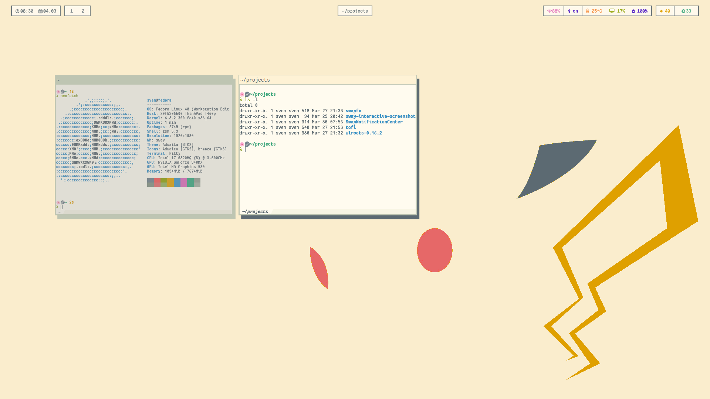

# configs
My config files for my Fedora Linux system. I do my best to credit everyone that I get my work (currently trying to do that with all my wallpapers) from so if you see something that you think needs attribution, let me know.

## Current
Currently I have my theme based on [Everforest](https://github.com/sainnhe/everforest/tree/master).

## Credits
The base Waybar config was ~~borrowed~~ ~~stolen~~ acquired from [Danko Fox](https://github.com/DankChoir). This was tweaked to fit each of the themes.

The sway colors for the rose-pine theme were taken from the [rose-pine project](https://github.com/rose-pine/i3).
