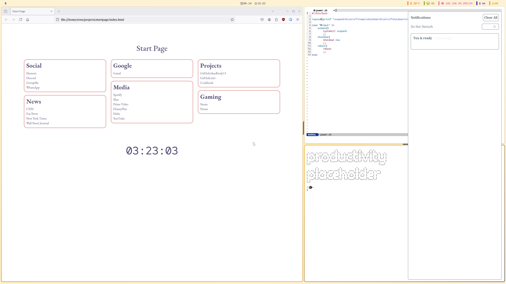

# configs
My config files for my Fedora Linux system. I do my best to credit everyone that I base my stuff on (currently trying to do that with all my wallpapers) so if you see something that you think needs attribution, let me know.

## Current
Currently, my setup is based on the [Everforest](https://github.com/sainnhe/everforest/tree/master) theme. Only important stuff happens here...

## Credits
The base Waybar config was ~~borrowed~~ ~~stolen~~ acquired from [Danko Fox](https://github.com/DankChoir). This was tweaked to fit each of the themes.
