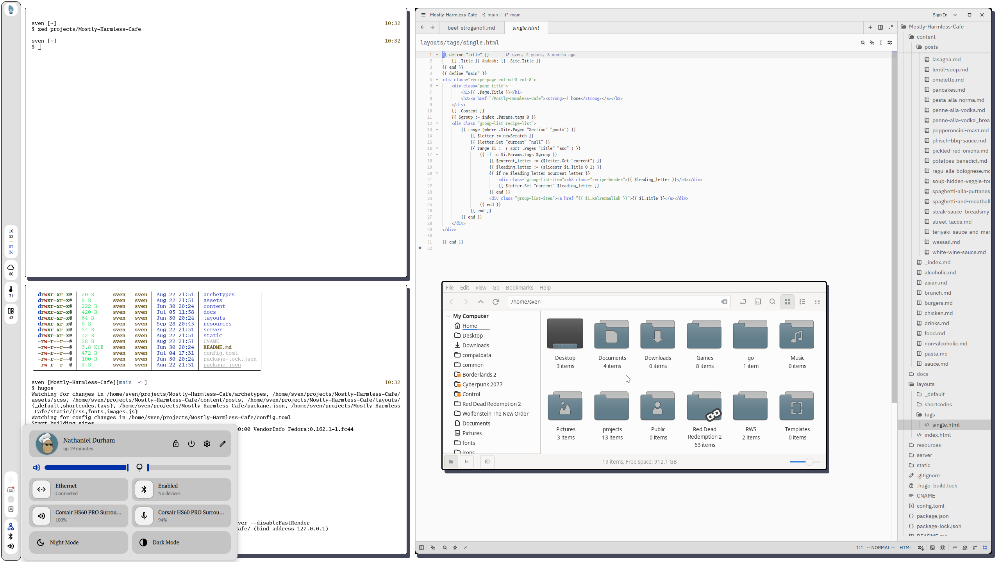

# configs
My config files for my Fedora Linux system. I do my best to credit everyone that I base my stuff on (currently trying to do that with all my wallpapers) so if you see something that you think needs attribution, let me know.

## Current
Currently, my setup uses mostly [Modus Operandi](https://protesilaos.com/emacs/modus-themes-colors). Only important stuff happens here...

